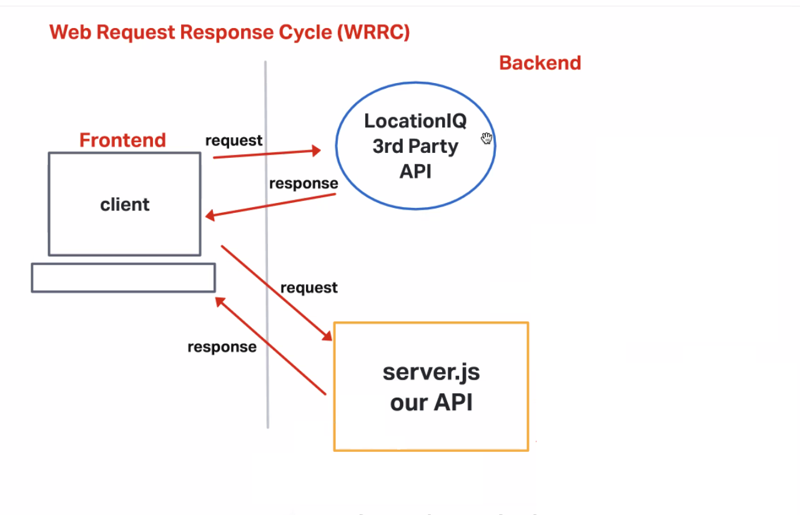

# first-express-server

**Author**: Dennis Nichols
**Version**: 1.0.0 (increment the patch/fix version number if you make more commits past your first submission)

## Overview

My own server / API to host weather data and respond to calls from the city explorer react app.

## Getting Started
To do this project, you need:
- express
- cors
- nodemon

## Architecture

## Change Log

10-25-2022 4:00pm - Application now has a structure for an Express server.
10-25-2022 5:00pm - Express server complete
## Credit and Collaborations
